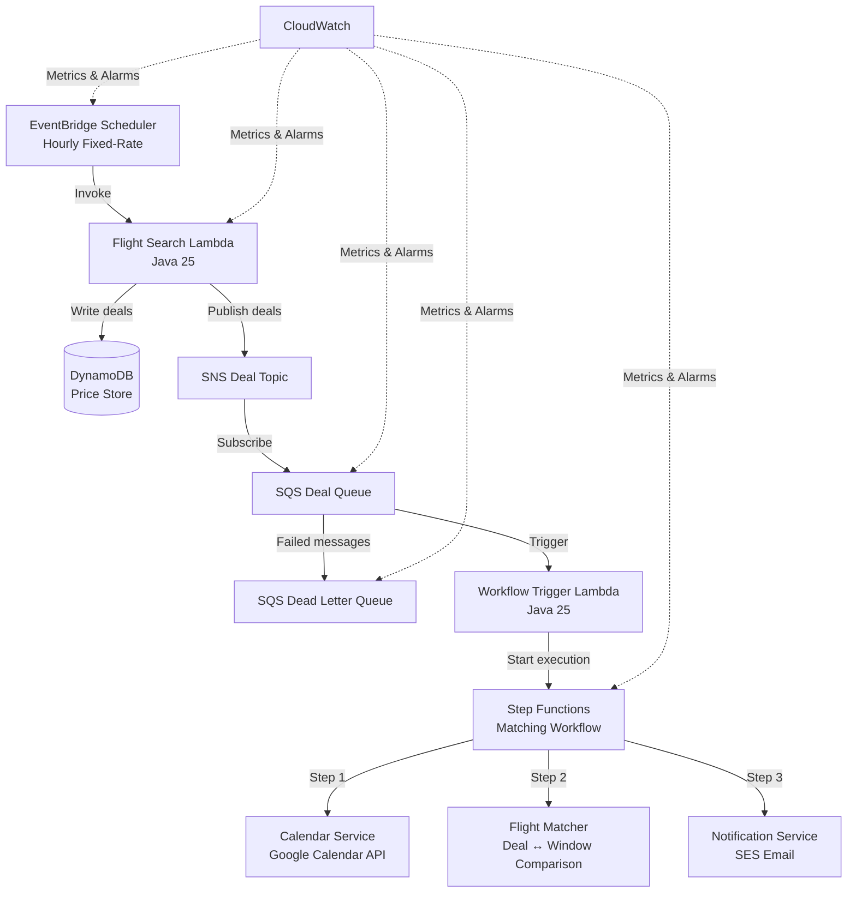
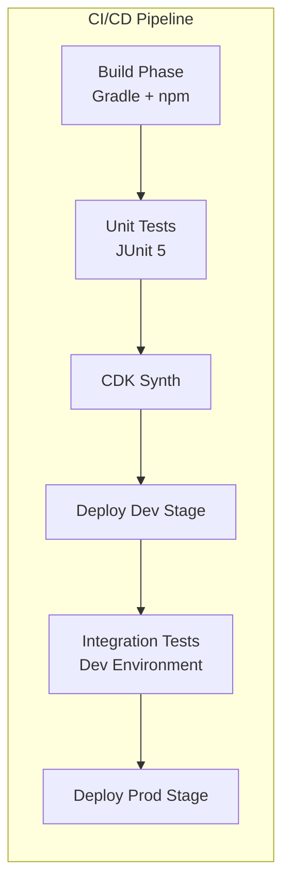
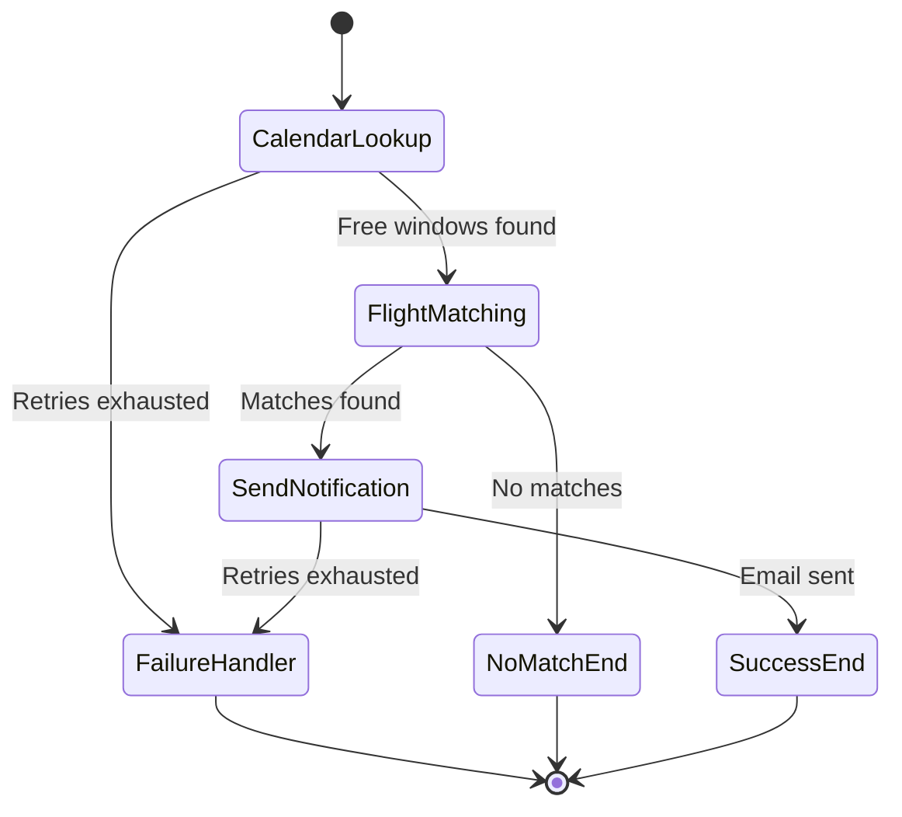

# Design Document: Flight Deal Notifier

## Overview

The Flight Deal Notifier is a serverless, event-driven system on AWS that automatically discovers cheap flights, checks them against the user's Google Calendar availability, and sends email notifications for actionable deals. The system runs on an hourly schedule, persists historical pricing data, and is designed for resilience through retry policies, dead-letter queues, and comprehensive observability.

The architecture follows an event-driven pipeline pattern:

1. **Trigger** — EventBridge fires hourly, invoking a Lambda to search for flights.
2. **Store** — Flight deals are written to DynamoDB for historical analysis.
3. **Publish** — Deals are published to SNS, fanning out to an SQS queue.
4. **Orchestrate** — A second Lambda consumes from SQS and kicks off a Step Functions workflow.
5. **Match & Notify** — The workflow fetches Google Calendar availability, matches deals to free windows, and emails the user.

All service code is Java 25. Infrastructure is AWS CDK with TypeScript. Data contracts are defined in Smithy IDL with generated Java types. Builds use Gradle (Java) and npm (CDK), orchestrated by a CI/CD pipeline with Dev and Prod stages.

## Architecture

### High-Level Architecture Diagram



### Deployment Architecture



### Key Architectural Decisions

| Decision | Choice | Rationale |
|---|---|---|
| Compute | AWS Lambda (Java 25) | Serverless, pay-per-use, no server management |
| Orchestration | Step Functions | Visual workflow, built-in retry/error handling, state management |
| Messaging | SNS → SQS | Fan-out capability, decoupled producers/consumers, DLQ support |
| Storage | DynamoDB | Serverless, single-digit ms latency, partition/sort key model fits time-series pricing |
| IaC | CDK (TypeScript) | Type-safe, composable constructs, native AWS integration |
| Data Contracts | Smithy IDL | Language-agnostic model definitions, Java code generation, compile-time type safety |
| Email | Amazon SES | Managed email service, integrates natively with Lambda |
| CI/CD | CodePipeline or GitHub Actions | Public, managed, supports multi-stage deployments |

## Components and Interfaces

### 1. EventBridge Scheduler

- **Type:** AWS EventBridge Rule (fixed-rate)
- **Schedule:** `rate(1 hour)`
- **Target:** Flight Search Lambda with retry policy (2 retries)
- **IAM:** Permission to invoke the Flight Search Lambda

### 2. Flight Search Lambda

- **Runtime:** Java 25 (custom runtime or Corretto)
- **Trigger:** EventBridge scheduled event
- **Responsibilities:**
  - Query external flight API for all configured destinations
  - Extract deal fields: destination, price, departure date, return date, airline
  - Write deal records to DynamoDB Price Store (retry 3x with exponential backoff)
  - Publish deal batch to SNS Deal Topic (retry 3x with exponential backoff)
  - Emit CloudWatch custom metrics: deals found, destinations searched, execution duration
- **Error Handling:** Per-destination error isolation — a failure for one destination does not block others
- **Timeout:** Configured to prevent runaway executions (e.g., 120 seconds)
- **Concurrency:** Reserved concurrency to prevent throttling cascades

**Interface (Smithy-generated):**
```
Input:  ScheduledEvent (EventBridge payload)
Output: FlightSearchResult { deals: List<FlightDeal>, errors: List<SearchError> }
```

### 3. DynamoDB Price Store

- **Table Name:** `FlightPriceHistory`
- **Partition Key:** `destination` (String)
- **Sort Key:** `timestamp` (String, ISO-8601)
- **Attributes:** destination, price, departureDate, returnDate, airline, retrievalTimestamp
- **Billing:** On-demand (pay-per-request)
- **Retention:** No TTL specified — records retained indefinitely for historical analysis

### 4. SNS Deal Topic

- **Type:** Standard SNS Topic
- **Subscribers:** SQS Deal Queue
- **Message Format:** JSON containing a list of `FlightDeal` objects
- **IAM:** Flight Search Lambda has `sns:Publish` permission

### 5. SQS Deal Queue

- **Type:** Standard SQS Queue
- **Subscription:** SNS Deal Topic
- **Visibility Timeout:** ≥ 6× Workflow Trigger Lambda timeout
- **Redrive Policy:** maxReceiveCount = 3, deadLetterTargetArn = Dead Letter Queue
- **Trigger:** Workflow Trigger Lambda (event source mapping)

### 6. SQS Dead Letter Queue

- **Type:** Standard SQS Queue
- **Message Retention:** 14 days
- **Alarm:** CloudWatch alarm on `ApproximateNumberOfMessagesVisible > 0`

### 7. Workflow Trigger Lambda

- **Runtime:** Java 25
- **Trigger:** SQS Deal Queue (event source mapping)
- **Responsibilities:**
  - Parse deal message from SQS event
  - Start Step Functions Matching Workflow execution with deal data as input
  - Emit CloudWatch custom metrics: workflows started, start failures
- **Error Handling:** Throws on workflow start failure so SQS retries the message
- **Timeout:** Configured to prevent runaway executions
- **Concurrency:** Reserved concurrency

**Interface (Smithy-generated):**
```
Input:  SQSEvent containing DealBatchMessage
Output: WorkflowStartResult { executionArn: String }
```

### 8. Step Functions Matching Workflow

- **Type:** Standard Workflow (Express not suitable due to potential long calendar API calls)
- **States:**



- **Retry Policy:** Each step has exponential backoff retries
- **Error Handling:** Failure state logs error details (step name, error type, input payload) and publishes failure event
- **Metrics:** Custom CloudWatch metrics for matches found and notifications sent

### 9. Calendar Service (Step Functions Task)

- **Runtime:** Lambda (Java 25) invoked by Step Functions
- **Responsibilities:**
  - Authenticate with Google Calendar API (OAuth2 credentials from SSM/Secrets Manager)
  - Retrieve free/busy windows for the date range covered by the deal batch
  - Return list of free time windows (start date, end date)
- **Retry:** 3 retries with exponential backoff (configured in Step Functions)

**Interface (Smithy-generated):**
```
Input:  CalendarLookupInput { dateRange: DateRange, deals: List<FlightDeal> }
Output: CalendarLookupOutput { freeWindows: List<TimeWindow> }
```

### 10. Flight Matcher (Step Functions Task)

- **Runtime:** Lambda (Java 25) invoked by Step Functions
- **Responsibilities:**
  - Compare each free calendar window against available flight deals
  - Select deals where departure and return dates fall entirely within a free window
  - Rank matched deals by price ascending
  - Return matched deals or empty list
- **No-match behavior:** Logs informational message, workflow ends without notification

**Interface (Smithy-generated):**
```
Input:  MatchInput { freeWindows: List<TimeWindow>, deals: List<FlightDeal> }
Output: MatchOutput { matchedDeals: List<FlightDeal> }
```

### 11. Notification Service (Step Functions Task)

- **Runtime:** Lambda (Java 25) invoked by Step Functions
- **Responsibilities:**
  - Format email body with matched deal details (destination, price, dates, airline)
  - Send email via Amazon SES to configured user email address
  - Retry up to 2 times on delivery failure
- **Retry:** 2 retries (configured in Step Functions)

**Interface (Smithy-generated):**
```
Input:  NotificationInput { matchedDeals: List<FlightDeal>, recipientEmail: String }
Output: NotificationOutput { success: Boolean, messageId: String }
```

### 12. CloudWatch Observability Stack

- **Dashboard:** Single dashboard displaying:
  - Lambda invocation counts and error rates
  - DynamoDB read/write capacity usage
  - SQS message age and approximate message count
  - Dead Letter Queue message count
- **Alarms:**
  - DLQ message count > 0
  - Flight Search Lambda error rate > 10% over 1 hour
  - Matching Workflow failure count > 0 in 1 hour
  - Deal Queue message age > 2 hours
- **Alerting:** All alarms notify a configured SNS topic (email/Slack)

### 13. CDK Infrastructure Organization

```
infra/
├── bin/
│   └── app.ts                    # CDK app entry point
├── lib/
│   ├── scheduling-construct.ts   # EventBridge rule
│   ├── data-store-construct.ts   # DynamoDB table
│   ├── messaging-construct.ts    # SNS topic, SQS queues, DLQ
│   ├── compute-construct.ts      # Lambda functions
│   ├── workflow-construct.ts     # Step Functions state machine
│   ├── observability-construct.ts# CloudWatch dashboard & alarms
│   └── pipeline-construct.ts     # CI/CD pipeline stages
├── package.json
└── tsconfig.json
```

## Data Models

All data shapes are defined in Smithy IDL and code-generated to Java types. Below are the core models.

### Smithy Model Definitions

```smithy
namespace com.flightdeal.model

/// A single flight deal from the external API
structure FlightDeal {
    @required
    destination: String

    @required
    price: BigDecimal

    @required
    departureDate: String  // ISO-8601 date

    @required
    returnDate: String     // ISO-8601 date

    @required
    airline: String
}

/// A time window representing a free period in the user's calendar
structure TimeWindow {
    @required
    startDate: String  // ISO-8601 date

    @required
    endDate: String    // ISO-8601 date
}

/// A date range for calendar queries
structure DateRange {
    @required
    startDate: String

    @required
    endDate: String
}

/// A record stored in DynamoDB for historical price tracking
structure PriceRecord {
    @required
    destination: String    // Partition key

    @required
    timestamp: String      // Sort key, ISO-8601

    @required
    price: BigDecimal

    @required
    departureDate: String

    @required
    returnDate: String

    @required
    airline: String

    @required
    retrievalTimestamp: String
}

/// The message published to SNS Deal Topic
structure DealBatchMessage {
    @required
    deals: FlightDealList

    @required
    searchTimestamp: String

    @required
    destinationsSearched: Integer
}

list FlightDealList {
    member: FlightDeal
}

list TimeWindowList {
    member: TimeWindow
}

/// Error details for a failed destination search
structure SearchError {
    @required
    destination: String

    @required
    errorMessage: String

    @required
    errorType: String
}

list SearchErrorList {
    member: SearchError
}

/// Result of the flight search operation
structure FlightSearchResult {
    @required
    deals: FlightDealList

    @required
    errors: SearchErrorList
}

/// Input to the Calendar Service step
structure CalendarLookupInput {
    @required
    dateRange: DateRange

    @required
    deals: FlightDealList
}

/// Output from the Calendar Service step
structure CalendarLookupOutput {
    @required
    freeWindows: TimeWindowList
}

/// Input to the Flight Matcher step
structure MatchInput {
    @required
    freeWindows: TimeWindowList

    @required
    deals: FlightDealList
}

/// Output from the Flight Matcher step
structure MatchOutput {
    @required
    matchedDeals: FlightDealList
}

/// Input to the Notification Service step
structure NotificationInput {
    @required
    matchedDeals: FlightDealList

    @required
    recipientEmail: String
}

/// Output from the Notification Service step
structure NotificationOutput {
    @required
    success: Boolean

    @required
    messageId: String
}

/// Workflow start result
structure WorkflowStartResult {
    @required
    executionArn: String
}
```

### Smithy Service Definitions

```smithy
namespace com.flightdeal.service

use com.flightdeal.model#FlightSearchResult
use com.flightdeal.model#CalendarLookupInput
use com.flightdeal.model#CalendarLookupOutput
use com.flightdeal.model#MatchInput
use com.flightdeal.model#MatchOutput
use com.flightdeal.model#NotificationInput
use com.flightdeal.model#NotificationOutput

service FlightSearchService {
    version: "2025-01-01"
    operations: [SearchFlights]
}

@readonly
operation SearchFlights {
    output: FlightSearchResult
}

service CalendarService {
    version: "2025-01-01"
    operations: [LookupCalendar]
}

@readonly
operation LookupCalendar {
    input: CalendarLookupInput
    output: CalendarLookupOutput
}

service FlightMatcherService {
    version: "2025-01-01"
    operations: [MatchFlights]
}

@readonly
operation MatchFlights {
    input: MatchInput
    output: MatchOutput
}

service NotificationService {
    version: "2025-01-01"
    operations: [SendNotification]
}

operation SendNotification {
    input: NotificationInput
    output: NotificationOutput
}
```

### DynamoDB Table Schema

| Attribute | Type | Key |
|---|---|---|
| `destination` | String | Partition Key |
| `timestamp` | String (ISO-8601) | Sort Key |
| `price` | Number | — |
| `departureDate` | String | — |
| `returnDate` | String | — |
| `airline` | String | — |
| `retrievalTimestamp` | String | — |

### Project Structure

```
flight-deal-notifier/
├── smithy/
│   └── model/
│       ├── model.smithy          # Data shapes
│       └── services.smithy       # Service interfaces
├── service/
│   ├── build.gradle              # Java 25, Smithy codegen, JUnit 5
│   └── src/
│       ├── main/java/com/flightdeal/
│       │   ├── handler/
│       │   │   ├── FlightSearchHandler.java
│       │   │   └── WorkflowTriggerHandler.java
│       │   ├── service/
│       │   │   ├── CalendarService.java
│       │   │   ├── FlightMatcher.java
│       │   │   └── NotificationService.java
│       │   ├── proxy/
│       │   │   ├── FlightApiClient.java
│       │   │   └── GoogleCalendarClient.java
│       │   └── metrics/
│       │       └── MetricsEmitter.java
│       └── test/java/com/flightdeal/
│           ├── handler/
│           │   ├── FlightSearchHandlerTest.java
│           │   └── WorkflowTriggerHandlerTest.java
│           ├── service/
│           │   ├── CalendarServiceTest.java
│           │   ├── FlightMatcherTest.java
│           │   └── NotificationServiceTest.java
│           └── property/
│               └── FlightMatcherPropertyTest.java
├── infra/
│   ├── bin/app.ts
│   ├── lib/
│   │   ├── scheduling-construct.ts
│   │   ├── data-store-construct.ts
│   │   ├── messaging-construct.ts
│   │   ├── compute-construct.ts
│   │   ├── workflow-construct.ts
│   │   ├── observability-construct.ts
│   │   └── pipeline-construct.ts
│   ├── package.json
│   └── tsconfig.json
├── integration-tests/
│   └── src/test/java/com/flightdeal/
│       ├── SchedulerIntegrationTest.java
│       ├── MessagingIntegrationTest.java
│       └── WorkflowIntegrationTest.java
└── README.md
```


## Correctness Properties

*A property is a characteristic or behavior that should hold true across all valid executions of a system — essentially, a formal statement about what the system should do. Properties serve as the bridge between human-readable specifications and machine-verifiable correctness guarantees.*

### Property 1: All configured destinations are queried

*For any* set of configured destinations, when the Flight Search Lambda is invoked, the number of flight API queries issued should equal the number of configured destinations.

**Validates: Requirements 2.1**

### Property 2: Deal extraction preserves all required fields

*For any* valid flight API response containing deal data, the extracted `FlightDeal` object should contain non-null values for destination, price, departure date, return date, and airline that match the source data.

**Validates: Requirements 2.2, 4.2**

### Property 3: Per-destination error isolation

*For any* set of destinations where a subset of API calls fail (error or timeout), the Flight Search Lambda should still return valid deal results for all destinations whose API calls succeeded, and the failed destinations should appear in the error list.

**Validates: Requirements 2.3**

### Property 4: DynamoDB write correctness

*For any* `FlightDeal` and retrieval timestamp, the record written to the Price Store should use the deal's destination as the partition key, an ISO-8601 timestamp as the sort key, and include all required fields (destination, price, departureDate, returnDate, airline, retrievalTimestamp).

**Validates: Requirements 3.1, 3.2**

### Property 5: Retry with exponential backoff

*For any* operation (DynamoDB write or SNS publish) that fails transiently, the retry mechanism should attempt up to the configured maximum retries (3), with each successive retry delay being greater than the previous delay.

**Validates: Requirements 3.3, 4.3**

### Property 6: Deal batch published after storage

*For any* non-empty list of flight deals successfully stored in the Price Store, a message should be published to the Deal Topic containing exactly those deals.

**Validates: Requirements 4.1**

### Property 7: Workflow started with correct deal data

*For any* valid `DealBatchMessage` received from the Deal Queue, the Workflow Trigger Lambda should start a Step Functions execution whose input contains the same deal data as the original message.

**Validates: Requirements 6.2**

### Property 8: Calendar date range derived from deals

*For any* non-empty list of flight deals, the Calendar Service should query the Google Calendar API with a date range spanning from the earliest departure date to the latest return date across all deals.

**Validates: Requirements 7.1**

### Property 9: Calendar response transformation

*For any* Google Calendar API response containing free/busy data, the Calendar Service should return a list of `TimeWindow` objects where each window has a valid start date that is before or equal to its end date.

**Validates: Requirements 7.3**

### Property 10: Flight matching predicate correctness

*For any* `FlightDeal` and `TimeWindow`, the Flight Matcher should select the deal as a match if and only if the deal's departure date is on or after the window's start date AND the deal's return date is on or before the window's end date.

**Validates: Requirements 8.1, 8.2**

### Property 11: Matched deals sorted by price ascending

*For any* list of matched flight deals returned by the Flight Matcher, the deals should be sorted in non-decreasing order by price.

**Validates: Requirements 8.3**

### Property 12: Notification email contains all deal fields

*For any* non-empty list of matched flight deals, the email body generated by the Notification Service should contain the destination, price, departure date, return date, and airline for every deal in the list.

**Validates: Requirements 9.1, 9.2**

### Property 13: Metrics emission accuracy

*For any* Flight Search Lambda execution, the emitted CloudWatch metrics for deals found, destinations searched, and execution duration should match the actual values from that execution. Similarly, *for any* Workflow Trigger Lambda execution, the workflows-started and start-failures metrics should match actual counts. *For any* Matching Workflow execution, the matches-found and notifications-sent metrics should match actual counts.

**Validates: Requirements 11.1, 11.2, 11.3**

## Error Handling

### Flight Search Lambda

| Error Scenario | Handling Strategy |
|---|---|
| External flight API error/timeout for a destination | Log error with destination and details, continue processing remaining destinations (Req 2.3) |
| External flight API returns empty results | Log informational message, skip destination (Req 2.4) |
| DynamoDB write failure | Retry up to 3 times with exponential backoff, then log failure (Req 3.3) |
| SNS publish failure | Retry up to 3 times with exponential backoff, then log failure (Req 4.3) |
| Lambda timeout | Configured timeout prevents runaway execution (Req 14.4) |

### Messaging Pipeline

| Error Scenario | Handling Strategy |
|---|---|
| SQS message processing failure | Message returns to queue, retried up to 3 times (Req 5.2) |
| All retries exhausted | Message moved to Dead Letter Queue (Req 5.2, 14.2) |
| DLQ receives message | CloudWatch alarm fires, operator notified (Req 12.1, 14.3) |
| Message age exceeds 2 hours | CloudWatch alarm fires (Req 12.5) |

### Workflow Trigger Lambda

| Error Scenario | Handling Strategy |
|---|---|
| Step Functions StartExecution fails | Lambda throws error, SQS retries the message (Req 6.3) |
| Lambda timeout | Configured timeout prevents runaway execution (Req 14.4) |

### Step Functions Matching Workflow

| Error Scenario | Handling Strategy |
|---|---|
| Google Calendar API error/unavailable | Retry up to 3 times with exponential backoff (Req 7.2) |
| Calendar step retries exhausted | Transition to failure state, log error details, publish failure event (Req 10.2, 10.3) |
| No deals match any free window | Log informational message, end workflow without notification (Req 8.4) |
| Email delivery failure | Retry up to 2 times (Req 9.3) |
| Notification retries exhausted | Mark step as failed, transition to failure state (Req 9.3, 10.2) |
| Any step exhausts retries | Failure state logs step name, error type, input payload; publishes failure event (Req 10.2, 10.3) |

### Observability Alarms

| Alarm | Condition | Action |
|---|---|---|
| DLQ Non-Empty | DLQ message count > 0 | Notify alerting channel (Req 12.1) |
| Flight Search Error Rate | > 10% over 1 hour | Notify alerting channel (Req 12.2) |
| Workflow Failures | Failure count > 0 in 1 hour | Notify alerting channel (Req 12.3) |
| Queue Message Age | > 2 hours | Notify alerting channel (Req 12.5) |

## Testing Strategy

### Dual Testing Approach

The system uses both unit tests and property-based tests for comprehensive coverage:

- **Unit tests** (JUnit 5): Verify specific examples, edge cases, error conditions, and integration points
- **Property-based tests** (jqwik): Verify universal properties across randomly generated inputs

Both are complementary — unit tests catch concrete bugs with known inputs, property tests verify general correctness across the input space.

### Property-Based Testing Configuration

- **Library:** [jqwik](https://jqwik.net/) — a JUnit 5-compatible property-based testing engine for Java
- **Minimum iterations:** 100 per property test
- **Tag format:** Each test is annotated with a comment: `Feature: flight-deal-notifier, Property {number}: {property_text}`
- **One test per property:** Each correctness property from the design is implemented by a single `@Property` test method

### Unit Test Coverage (JUnit 5)

Unit tests mock all external dependencies (flight API, Google Calendar API, DynamoDB, SNS, SQS, Step Functions) using Mockito.

| Component | Test Focus |
|---|---|
| FlightSearchHandler | Success path (deals found), partial failures (some destinations fail), all destinations fail, empty results, DynamoDB write retry exhaustion, SNS publish retry exhaustion |
| WorkflowTriggerHandler | Successful workflow start, StartExecution failure throws error, malformed SQS message |
| CalendarService | Successful calendar lookup, date range calculation, API error handling |
| FlightMatcher | Deals within windows, deals outside windows, partial overlaps rejected, empty deals, empty windows, price sorting |
| NotificationService | Successful email send, email formatting, delivery failure |
| MetricsEmitter | Correct metric names and values emitted |

### Property-Based Test Coverage (jqwik)

Each property test uses jqwik's `@Property` annotation with `tries = 100` minimum. Custom `@Provide` methods generate random `FlightDeal`, `TimeWindow`, `DealBatchMessage`, and other Smithy-generated types.

| Property | Test Method | Component Under Test |
|---|---|---|
| Property 1: All destinations queried | `allConfiguredDestinationsAreQueried` | FlightSearchHandler |
| Property 2: Deal extraction field preservation | `dealExtractionPreservesAllFields` | FlightSearchHandler |
| Property 3: Error isolation | `failedDestinationsDoNotBlockSuccessful` | FlightSearchHandler |
| Property 4: DynamoDB write correctness | `priceStoreWriteContainsCorrectKeysAndFields` | FlightSearchHandler |
| Property 5: Retry with backoff | `retryDelaysAreMonotonicallyIncreasing` | RetryPolicy utility |
| Property 6: Publish after store | `publishedDealsMatchStoredDeals` | FlightSearchHandler |
| Property 7: Workflow input correctness | `workflowInputMatchesDealBatchMessage` | WorkflowTriggerHandler |
| Property 8: Calendar date range | `calendarQuerySpansMinDepartureToMaxReturn` | CalendarService |
| Property 9: Calendar transformation | `freeWindowsHaveValidStartBeforeEnd` | CalendarService |
| Property 10: Matching predicate | `dealMatchesIffEntirelyWithinWindow` | FlightMatcher |
| Property 11: Price sort order | `matchedDealsAreSortedByPriceAscending` | FlightMatcher |
| Property 12: Email completeness | `emailBodyContainsAllDealFields` | NotificationService |
| Property 13: Metrics accuracy | `emittedMetricsMatchActualCounts` | MetricsEmitter |

### Integration Test Coverage

Integration tests run against the deployed Dev Stage environment after CDK deployment.

| Test | Validates |
|---|---|
| Scheduler → Lambda → DynamoDB | EventBridge triggers Lambda, deals appear in Price Store (Req 18.1) |
| SNS → SQS message delivery | Messages published to Deal Topic arrive in Deal Queue (Req 18.2) |
| SQS → Lambda → Step Functions | Workflow Trigger Lambda starts Matching Workflow from queue message (Req 18.3) |

### CDK Assertion Tests

Infrastructure configuration is validated using CDK assertion tests (`aws-cdk-lib/assertions`):

- EventBridge rule schedule rate and retry policy (Req 1.1, 1.3)
- SQS queue visibility timeout, redrive policy, DLQ retention (Req 5.2, 5.3, 5.4)
- Lambda reserved concurrency, memory, timeout settings (Req 14.1, 14.4)
- CloudWatch alarms thresholds and actions (Req 12.1–12.5)
- IAM least-privilege policies (Req 15.3)
- Step Functions retry policies per state (Req 10.1)
